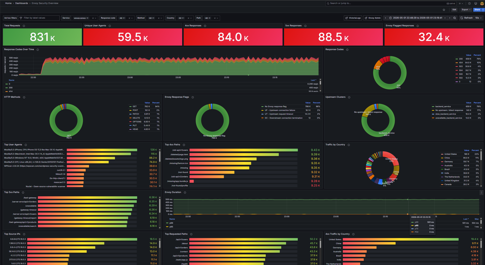

# Envoy Security Observability Demo

A local Docker Compose lab for exploring Envoy access logs, security-relevant traffic patterns, GeoIP enrichment, VictoriaLogs queries, and a provisioned Grafana dashboard.

The stack generates synthetic web traffic through Envoy, writes structured JSON access logs, enriches the logs with Grafana Alloy, stores them in VictoriaLogs, and visualizes them in Grafana.

## What this project contains

| Component | Purpose | Main files |
| --- | --- | --- |
| Envoy proxy | Front door for all demo traffic; emits JSON access logs and generates selected 404/5xx/upstream-failure cases | `envoy/envoy.yaml` |
| Backend | Simple application target for normal traffic | `docker-compose.yml` |
| Slow backend | Deliberately slow target used to trigger real Envoy upstream timeouts | `docker-compose.yml` |
| Load generator | Produces normal traffic, scanner-like paths, 404s, 5xxs, timeouts, upstream failures, user agents, and simulated source IPs | `load-generator/generate.py` |
| GeoIP downloader | Downloads DB-IP City Lite MMDB for IP enrichment | `geoip-downloader/download.sh` |
| Grafana Alloy | Tails Envoy logs, parses JSON, enriches with GeoIP, and forwards logs to VictoriaLogs | `alloy/config.alloy` |
| VictoriaLogs | Stores logs and serves LogSQL queries through the Grafana datasource | `docker-compose.yml` |
| Grafana | Provides the provisioned security dashboard | `grafana/dashboards/envoy-security-overview.json` |

## Architecture

```text
load-generator
      |
      v
Envoy :10000  ---> backend / slow-backend / direct responses
      |
      | JSON access log: /var/log/envoy/access.log
      v
Grafana Alloy
  - tails file
  - parses JSON
  - extracts first X-Forwarded-For IP
  - enriches GeoIP
  - writes structured metadata
      |
      v
VictoriaLogs :9428
      |
      v
Grafana :3000
  - VictoriaLogs datasource
  - Envoy Security Overview dashboard
```

## Quick start

Start or rebuild the full stack:

```bash
docker compose up -d --build
```

Open the main services:

- Grafana: http://localhost:3000
- Dashboard: http://localhost:3000/d/envoy-security-overview/envoy-security-overview
- VictoriaLogs UI/API: http://localhost:9428
- Envoy admin: http://localhost:9901
- Envoy listener: http://localhost:10000
- Alloy UI: http://localhost:12345

Grafana credentials are configured as `admin` / `admin`, and anonymous admin access is enabled for this local demo.

Stop the stack:

```bash
docker compose down
```

Remove persisted data volumes if you want a clean reset:

```bash
docker compose down -v
```

## Envoy configuration

Envoy listens on port `10000` and proxies requests to the backend service. Its admin interface is exposed on port `9901`.

The important Envoy behavior is configured in `envoy/envoy.yaml`:

### JSON access logs

Envoy writes one structured JSON log entry per request to:

```text
/var/log/envoy/access.log
```

That file lives in the shared `envoy-logs` Docker volume. Alloy mounts the same volume read-only and tails it.

Important fields emitted by Envoy include:

| Field | Meaning |
| --- | --- |
| `message` | Human-readable request summary used as the log body |
| `http_request_method` | HTTP method |
| `http_response_status_code` | Response status code |
| `url_path` | Request path |
| `url_full` | Full URL assembled from scheme, host, and path |
| `client_address` | Downstream remote address observed by Envoy |
| `user_agent_original` | Raw `User-Agent` request header |
| `http_request_header_x_forwarded_for` | Simulated public source IP header generated by the load generator |
| `envoy_duration_ms` | Envoy request duration in milliseconds |
| `envoy_response_flags` | Envoy response flags such as `UT` or `UF` |
| `envoy_upstream_cluster` | Upstream cluster selected by Envoy |
| `envoy_request_id` | Envoy request ID |
| `service_name` | Gateway/service identifier. This demo uses `envoy-proxy`, but each Envoy gateway can set a different value so logs and dashboards can differentiate between gateways |

### Demo routes

The route table intentionally creates several traffic classes so the dashboard has useful data immediately.

Normal traffic routes to `backend_service`:

```text
/  -> backend_service
```

Synthetic 404 routes return direct responses from Envoy:

```text
/missing
/not-found
/old-api
/deleted
```

Synthetic 5xx routes also return direct Envoy responses:

```text
/server-error       -> 500
/bad-gateway        -> 502
/unavailable        -> 503
/gateway-timeout    -> 504
```

Real upstream problem routes exercise Envoy response flags:

| Route | Behavior | Expected result |
| --- | --- | --- |
| `/slow` | Sends traffic to `slow_backend_service`, which sleeps longer than Envoy's `0.5s` route timeout | `504` with `UT` upstream timeout flag |
| `/upstream-unavailable` | Sends traffic to `unavailable_backend_service`, which points at closed port `81` on the backend container | `503` with `UF` upstream connection failure flag |

### Upstream clusters

| Cluster | Target | Purpose |
| --- | --- | --- |
| `backend_service` | `backend:80` | Normal application traffic |
| `slow_backend_service` | `slow-backend:8080` | Generates real upstream timeouts |
| `unavailable_backend_service` | `backend:81` | Generates upstream connection failures |

## Log pipeline

The active log pipeline is implemented by Grafana Alloy in `alloy/config.alloy`.

### 1. File discovery

`local.file_match "envoy_logs"` watches:

```text
/var/log/envoy/access.log
```

### 2. File tailing

`loki.source.file "envoy"` tails the log file and tracks read position in Alloy storage so logs are not repeatedly re-read during normal restarts.

### 3. JSON parsing

`loki.process "enrich"` parses each JSON log entry with `stage.json`. Every relevant Envoy field is copied into Alloy's extracted map.

### 4. Log body selection

The `message` field is used as the final log line body via `stage.template` and `stage.output`, while the structured fields remain available as metadata for queries.

### 5. Source IP extraction

The load generator sets `X-Forwarded-For` to public-looking simulated IPs. Alloy extracts the first IPv4 address from that header into `client_public_ip` so multi-hop values do not break GeoIP lookup.

### 6. GeoIP enrichment

`stage.geoip` reads `/geoip/city.mmdb`, which is downloaded by `geoip-downloader`, and adds fields such as:

- `geoip_country`
- `geoip_country_code`
- `geoip_city`
- `geoip_continent`
- `geoip_latitude`
- `geoip_longitude`
- `geoip_asn`
- `geoip_asn_org`

If the database is missing or an IP cannot be resolved, GeoIP fields can be empty. Dashboard queries handle empty country values with `Unknown country` display labels.

### 7. Structured metadata and labels

All parsed and enriched fields are promoted as structured metadata. The only stream label is `service_name`, which keeps stream cardinality low while preserving rich queryable metadata. In a multi-gateway environment, set a distinct `service_name` value per Envoy gateway, for example `edge-gateway`, `internal-gateway`, or `partner-api-gateway`, so Grafana can filter and compare gateway traffic independently.

### 8. VictoriaLogs write path

Alloy writes to VictoriaLogs through the Loki-compatible endpoint:

```text
http://victoria-logs:9428/insert/loki/api/v1/push
```

Grafana queries the same VictoriaLogs instance through the `victoriametrics-logs-datasource` plugin.

## Load generator

The load generator runs continuously as the `load-generator` service and sends requests to Envoy at the configured target and rate.

Environment variables:

| Variable | Default in Compose | Meaning |
| --- | --- | --- |
| `TARGET_URL` | `http://envoy:10000` | Envoy listener URL inside Docker |
| `REQUESTS_PER_SECOND` | `50` | Approximate traffic generation rate |

Traffic profiles include:

- Normal browser-like requests to paths such as `/`, `/health`, `/api/v1/users`, `/dashboard`.
- Recon/scanner paths such as `/.env`, `/.git/config`, `/wp-admin/`, `/phpmyadmin/`, `/actuator/env`.
- Intentional 404 paths such as `/missing`, `/not-found`, `/old-api/...`, `/deleted/...`.
- Intentional 5xx direct-response paths such as `/server-error`, `/bad-gateway`, `/unavailable`, `/gateway-timeout`.
- Upstream timeout and failure paths such as `/slow` and `/upstream-unavailable`.
- Browser and scanner-like user agents.
- Public simulated `X-Forwarded-For` source IPs weighted across many countries and providers so GeoIP panels have realistic variety.
- Extra HTTP methods such as `POST`, `PUT`, `DELETE`, `PATCH`, `OPTIONS`, and `HEAD`.
- SQL-injection-like paths for search and login examples.

## Grafana dashboard

**Live snapshot:** [https://snapshots.raintank.io/dashboard/snapshot/enbuosXHg1k5dhAQBqbNFzYurl9hR2zU](https://snapshots.raintank.io/dashboard/snapshot/enbuosXHg1k5dhAQBqbNFzYurl9hR2zU)



The dashboard is provisioned from:

```text
grafana/dashboards/envoy-security-overview.json
```

Grafana loads it through:

```text
grafana/provisioning/dashboards/default.yaml
```

The datasource is provisioned from:

```text
grafana/provisioning/datasources/victorialogs.yaml
```

Dashboard UID:

```text
envoy-security-overview
```

### Dashboard variables

| Variable | Purpose |
| --- | --- |
| `ad_hoc_filters` | Free-form metadata filters from Grafana's ad hoc filter UI and panel data links |
| `service_name` | Multi-select service/gateway filter. Defaults to `envoy-proxy`; use different `service_name` values to differentiate between Envoy gateways and view one gateway or all gateways in the same dashboard |
| `response_code` | Multi-select HTTP status code filter |
| `method` | Multi-select HTTP method filter |
| `country` | Multi-select GeoIP country filter |
| `path` | Multi-select URL path filter |

Most queries start with this base filter pattern:

```logql
{service_name=~"${service_name:regex}"} http_response_status_code:in($response_code) http_request_method:in($method) geoip_country:in($country) url_path:in($path)
```

### Dashboard layout

Top summary stats:

- `Total Requests` — count of access logs in the selected time range.
- `Unique User Agents` — distinct user-agent values.
- `4xx Responses` — client error count.
- `5xx Responses` — server error count.
- `Envoy Flagged Responses` — count of responses where `envoy_response_flags` is not `-`.

Response-code overview:

- `Response Codes Over Time` — per-status-code request rate over time, calculated with `stats by (http_response_status_code) rate()` and displayed as requests per second.
- `Response Codes` — donut chart showing status-code share over the selected time range.

Pie-chart row:

- `HTTP Methods` — method distribution.
- `Envoy Response Flags` — flag distribution with human-readable flag descriptions.
- `Upstream Clusters` — cluster distribution, including direct responses shown as `No upstream / direct response`.

Traffic breakdown rows:

- `Top User Agents` — top user agents by request count.
- `Top 4xx Paths` — most common client-error paths.
- `Traffic by Country` — GeoIP country distribution.
- `Top 5xx Paths` — most common server-error paths.
- `Envoy Duration` — average and p95 duration over time.
- `Top Source IPs` — top simulated `X-Forwarded-For` values.
- `Top Requested Paths` — most requested paths overall.
- `4xx Traffic by Country` — countries associated with client-error traffic.
- `Recent Non-2xx / Flagged Logs` — raw recent logs for 4xx, 5xx, and Envoy-flagged responses.

### Envoy response flag mapping

The dashboard maps Envoy response flag codes into readable labels using LogSQL `copy` and `replace` operations.

Common mappings include:

| Flag | Meaning |
| --- | --- |
| `-` | No Envoy response flag |
| `UT` | Upstream request timeout |
| `UF` | Upstream connection failure |
| `UH` | No healthy upstream hosts |
| `UC` | Upstream connection termination |
| `UR` | Upstream remote reset |
| `UO` | Upstream overflow |
| `NR` | No route configured |
| `LR` | Local reset |
| `DC` | Downstream connection termination |
| `DI` | Delay-injected fault |
| `FI` | Fault-injected response |
| `RL` | Rate limited |
| `UA` | External authorization denied |
| `IH` | Invalid request headers |
| `SI` | Stream idle timeout |
| `DPE` | Downstream protocol error |
| `UPE` | Upstream protocol error |
| `RLSE` | Rate limit service error |
| `UMSDR` | Upstream max stream duration reached |

### Data links and ad hoc filtering

Several top-list panels include data links that add ad hoc filters to the dashboard. Examples:

- Filter by user agent.
- Filter by source IP.
- Filter by URL path.
- Filter by country.
- Filter by upstream cluster.

Grafana encodes commas in ad hoc filter values internally as `__gfc__`. Queries that power ad hoc links create separate `*_filter` fields and replace commas with `__gfc__` before data-link URL encoding. This avoids broken filters for values such as comma-separated `X-Forwarded-For` headers or complex user-agent strings.

## Attack scenarios: detect and mitigate

This demo intentionally generates several security-relevant traffic patterns. The goal is to show how Envoy access logs, enriched metadata, and the Grafana dashboard help move from symptom to investigation to mitigation.

> The mitigations below are examples for a real environment. This local demo does not deploy a WAF, rate limiter, SIEM, or firewall policy by default.

### Scenario 1: Automated reconnaissance and path scanning

**What it looks like**

- Many requests for paths that should not exist, such as `/.env`, `/.git/config`, `/wp-admin/`, `/phpmyadmin/`, `/actuator/env`, `/server-status`, or `/openapi.json`.
- Increased `4xx Responses`, especially `404`.
- Repeated scanner-like user agents such as `Nikto`, `sqlmap`, `Nuclei`, `ffuf`, `WPScan`, `curl`, or `Go-http-client`.

**Where to detect it**

- `4xx Responses` stat panel.
- `Top 4xx Paths` panel.
- `Top User Agents` panel.
- `Top Source IPs` panel.
- `Recent Non-2xx / Flagged Logs` panel.

**Useful query**

```logql
{service_name="envoy-proxy"} http_response_status_code:~"4.." | stats by (url_path, user_agent_original, http_request_header_x_forwarded_for) count() as hits | sort by (hits desc) | limit 20
```

**How to investigate**

1. Open `Top 4xx Paths` and identify the most frequently requested missing or sensitive paths.
2. Use the panel data link to filter on a suspicious path.
3. Check `Top Source IPs` and `Top User Agents` under that filter.
4. Review `Recent Non-2xx / Flagged Logs` for request timing and path variety.

**Mitigation ideas**

- Rate-limit repeated `404` responses per source IP or per user agent.
- Block or challenge known scanner user agents at the edge, while avoiding sole reliance on user-agent strings because they are easy to spoof.
- Add WAF rules for sensitive paths that should never be public.
- Return generic responses for sensitive route probes to reduce information disclosure.
- Alert when unique 404 paths per source exceed a baseline threshold.

### Scenario 2: SQL injection and script-injection probing

**What it looks like**

- Paths or query strings containing patterns such as quotes, SQL comments, `OR 1=1`, `DROP TABLE`, or HTML/script payloads.
- Requests often come from scanner user agents or a small set of repeated source IPs.
- Responses can be `200`, `4xx`, or `5xx`, depending on application behavior.

**Where to detect it**

- `Top Requested Paths` panel.
- `Top User Agents` panel.
- `Recent Non-2xx / Flagged Logs` panel.
- `Response Codes Over Time` for spikes in `4xx` or `5xx` during probing.

**Useful query**

```logql
{service_name="envoy-proxy"} (url_path:"'" OR url_path:"<script" OR url_path:"DROP" OR url_path:"--") | stats by (url_path, user_agent_original, http_response_status_code, http_request_header_x_forwarded_for) count() as hits | sort by (hits desc) | limit 20
```

**How to investigate**

1. Search for suspicious query strings in `url_path`.
2. Compare status codes: `5xx` can indicate the payload is causing application-side errors.
3. Filter on the source IP and user agent to see whether the same actor is probing multiple endpoints.
4. Correlate with backend application logs if available.

**Mitigation ideas**

- Validate and parameterize all database inputs in the application.
- Add WAF signatures for common SQL injection and XSS payload patterns.
- Normalize and reject malformed requests before they reach the application.
- Alert on repeated suspicious payloads, especially when followed by `5xx` responses.
- Review application error handling so exceptions do not leak stack traces or schema details.

### Scenario 3: 5xx spike from application or upstream errors

**What it looks like**

- Increase in `5xx Responses`.
- `Response Codes Over Time` shows `500`, `502`, `503`, or `504` rates rising.
- `Top 5xx Paths` identifies which route is failing most often.

**Where to detect it**

- `5xx Responses` stat panel.
- `Response Codes Over Time` panel.
- `Response Codes` pie chart.
- `Top 5xx Paths` panel.
- `Recent Non-2xx / Flagged Logs` panel.

**Useful query**

```logql
{service_name="envoy-proxy"} http_response_status_code:~"5.." | stats by (http_response_status_code, envoy_response_flags, url_path, envoy_upstream_cluster) count() as hits | sort by (hits desc) | limit 20
```

**How to investigate**

1. Check whether the spike is isolated to one status code or one path.
2. Check `envoy_response_flags`: `-` often means Envoy returned a response without a special proxy flag, while flags such as `UT` and `UF` indicate proxy/upstream behavior.
3. Use `Upstream Clusters` to determine whether failures involve a specific upstream.
4. Review `Envoy Duration`; high latency plus `504` often points to timeouts.

**Mitigation ideas**

- Roll back or fix the failing backend deployment.
- Add health checks and remove unhealthy upstreams from load balancing.
- Tune Envoy timeouts only after confirming whether the backend should legitimately take longer.
- Add circuit breakers, retry budgets, and outlier detection where appropriate.
- Alert on `5xx` rate, not only raw count, so traffic spikes do not hide real error-rate changes.

### Scenario 4: Upstream timeout (`UT`)

**What it looks like**

- `504` responses with Envoy flag `UT`.
- Higher `envoy_duration_ms` values around the configured route timeout.
- In this demo, `/slow` intentionally triggers this condition.

**Where to detect it**

- `Envoy Flagged Responses` stat panel.
- `Envoy Response Flags` pie chart.
- `Top 5xx Paths` panel.
- `Envoy Duration` panel.
- `Recent Non-2xx / Flagged Logs` panel.

**Useful query**

```logql
{service_name="envoy-proxy"} envoy_response_flags:"UT" | stats by (url_path, http_response_status_code, envoy_upstream_cluster) count() as hits | sort by (hits desc)
```

**How to investigate**

1. Filter the dashboard on `envoy_response_flags = UT` using ad hoc filters or Explore.
2. Identify the path and upstream cluster producing timeouts.
3. Compare average and p95 duration around the incident window.
4. Check backend latency, saturation, database calls, and dependency latency.

**Mitigation ideas**

- Fix the slow backend dependency or query path.
- Add caching for expensive endpoints.
- Introduce asynchronous processing for long-running operations.
- Tune Envoy route timeout only if the business operation is expected to exceed the current limit.
- Add concurrency limits and load shedding to protect the backend during overload.

### Scenario 5: Upstream connection failure (`UF`)

**What it looks like**

- `503` responses with Envoy flag `UF`.
- Failures grouped under a specific upstream cluster.
- In this demo, `/upstream-unavailable` points at a closed backend port to generate this signal.

**Where to detect it**

- `Envoy Response Flags` pie chart.
- `Upstream Clusters` pie chart.
- `Top 5xx Paths` panel.
- `Recent Non-2xx / Flagged Logs` panel.

**Useful query**

```logql
{service_name="envoy-proxy"} envoy_response_flags:"UF" | stats by (url_path, envoy_upstream_cluster, server_address) count() as hits | sort by (hits desc)
```

**How to investigate**

1. Confirm whether the failures are isolated to one cluster or host.
2. Check service discovery, DNS, target port, and network policy.
3. Confirm the backend container or pod is listening and healthy.
4. Compare with deployment or infrastructure changes in the same time window.

**Mitigation ideas**

- Fix the upstream service address, port, or DNS record.
- Ensure health checks remove unavailable endpoints.
- Add readiness checks so new instances are not routed before they are ready.
- Use outlier detection to eject consistently failing endpoints.
- Add alerts on `UF` count or rate per upstream cluster.

### Scenario 6: Geographic anomaly or unexpected source region

**What it looks like**

- Traffic from a country or ASN that is unusual for the service.
- A region suddenly dominates `4xx` or scanner traffic.
- A source country appears in `Traffic by Country` and `4xx Traffic by Country` with a high share.

**Where to detect it**

- `Traffic by Country` panel.
- `4xx Traffic by Country` panel.
- `Top Source IPs` panel.
- `Top User Agents` panel while filtered by country.

**Useful query**

```logql
{service_name="envoy-proxy"} http_response_status_code:~"4.." | copy geoip_country as geoip_country_display | format if (geoip_country:"") "Unknown country" as geoip_country_display | stats by (geoip_country_display, http_request_header_x_forwarded_for, user_agent_original) count() as hits | sort by (hits desc) | limit 20
```

**How to investigate**

1. Filter on the unexpected country from the dashboard.
2. Check whether traffic is normal application paths or scanner/recon paths.
3. Review top source IPs and user agents for concentration.
4. Compare current traffic with expected customer geography.

**Mitigation ideas**

- Add geo-based alerting for unexpected countries or ASNs.
- Challenge or rate-limit high-risk regions when business requirements allow it.
- Prefer risk-based controls over blanket blocking if legitimate users may be affected.
- Combine GeoIP with user-agent, path, response-code, and source-IP behavior before taking action.

### Scenario 7: Suspicious HTTP method usage

**What it looks like**

- Unexpected `PUT`, `PATCH`, `DELETE`, `OPTIONS`, or `HEAD` traffic against public endpoints.
- Mutating methods against paths normally expected to be read-only.
- Method distribution shifts in the `HTTP Methods` pie chart.

**Where to detect it**

- `HTTP Methods` pie chart.
- `Top Requested Paths` panel after filtering to a method.
- `Recent Non-2xx / Flagged Logs` panel.

**Useful query**

```logql
{service_name="envoy-proxy"} http_request_method:in(POST,PUT,PATCH,DELETE,OPTIONS) | stats by (http_request_method, url_path, http_response_status_code, http_request_header_x_forwarded_for) count() as hits | sort by (hits desc) | limit 20
```

**How to investigate**

1. Filter the dashboard by the unexpected method.
2. Check which paths receive that method.
3. Determine whether the method is allowed by the application contract.
4. Review source IPs and user agents for automation patterns.

**Mitigation ideas**

- Restrict allowed HTTP methods per route in Envoy or the application gateway.
- Return `405 Method Not Allowed` for unsupported methods.
- Require authentication and authorization for mutating routes.
- Alert on unusual method/path combinations.

### Scenario 8: High-volume single source or bot behavior

**What it looks like**

- One source IP or a small set of source IPs dominates request volume.
- The same source rapidly touches many paths.
- A single user agent appears with unusually high volume.

**Where to detect it**

- `Top Source IPs` panel.
- `Top User Agents` panel.
- `Top Requested Paths` panel.
- `Response Codes Over Time` for correlated error-rate changes.

**Useful query**

```logql
{service_name="envoy-proxy"} | stats by (http_request_header_x_forwarded_for, user_agent_original) count() as hits, count_uniq(url_path) as unique_paths | sort by (hits desc) | limit 20
```

**How to investigate**

1. Identify dominant source IPs and user agents.
2. Check whether the source touches many unique paths or repeatedly hits one expensive path.
3. Filter by source IP to inspect status-code mix and paths.
4. Compare request rate against normal baselines.

**Mitigation ideas**

- Apply per-IP and per-token rate limits.
- Add bot challenges or stricter authentication on sensitive endpoints.
- Use adaptive throttling for expensive paths.
- Add allowlists for trusted automation and blocklists for confirmed abusive clients.
- Alert on request rate, unique path count, and error rate per source.

## Useful queries

Use these in Grafana Explore or VictoriaLogs query UI.

All Envoy logs:

```logql
{service_name="envoy-proxy"}
```

5xx breakdown by status, flag, and path:

```logql
{service_name="envoy-proxy"} http_response_status_code:~"5.." | stats by (http_response_status_code, envoy_response_flags, url_path) count() as hits | sort by (hits desc)
```

Real upstream timeout events:

```logql
{service_name="envoy-proxy"} envoy_response_flags:"UT"
```

Real upstream connection failures:

```logql
{service_name="envoy-proxy"} envoy_response_flags:"UF"
```

Request rate by status code:

```logql
{service_name="envoy-proxy"} | stats by (http_response_status_code) rate()
```

Top paths:

```logql
{service_name="envoy-proxy"} | stats by (url_path) count() as hits | sort by (hits desc) | limit 10
```

Top countries:

```logql
{service_name="envoy-proxy"} | copy geoip_country as geoip_country_display | format if (geoip_country:"") "Unknown country" as geoip_country_display | stats by (geoip_country_display) count() as hits | sort by (hits desc)
```

## Operational checks

Check service status:

```bash
docker compose ps
```

Watch load generator logs:

```bash
docker compose logs -f load-generator
```

Watch Envoy logs:

```bash
docker compose logs -f envoy
```

Check raw access log file inside Envoy:

```bash
docker compose exec envoy tail -f /var/log/envoy/access.log
```

Smoke-test important routes:

```bash
curl -i http://localhost:10000/
curl -i http://localhost:10000/missing
curl -i http://localhost:10000/server-error
curl -i http://localhost:10000/slow
curl -i http://localhost:10000/upstream-unavailable
```

Expected examples:

| Request | Expected status | Notes |
| --- | --- | --- |
| `/` | `200` | Normal backend response |
| `/missing` | `404` | Envoy direct response |
| `/server-error` | `500` | Envoy direct response |
| `/bad-gateway` | `502` | Envoy direct response |
| `/unavailable` | `503` | Envoy direct response |
| `/gateway-timeout` | `504` | Envoy direct response |
| `/slow` | `504` | Real Envoy timeout, usually `UT` |
| `/upstream-unavailable` | `503` | Real upstream connection failure, usually `UF` |

## Troubleshooting

### Grafana dashboard does not update

The dashboard provider polls files every 30 seconds. Wait briefly, refresh the dashboard, or restart Grafana:

```bash
docker compose restart grafana
```

### No logs in Grafana

Check the pipeline in order:

1. Is the load generator running?
   ```bash
   docker compose logs --tail=50 load-generator
   ```
2. Is Envoy writing access logs?
   ```bash
   docker compose exec envoy tail -n 5 /var/log/envoy/access.log
   ```
3. Is Alloy running and shipping?
   ```bash
   docker compose logs --tail=100 alloy
   ```
4. Is VictoriaLogs reachable?
   ```bash
   curl http://localhost:9428
   ```

### GeoIP country is empty

GeoIP depends on the DB-IP database downloaded into the `geoip-data` volume. If the download failed, inspect:

```bash
docker compose logs geoip-downloader
```

The dashboard labels empty countries as `Unknown country` so panels remain readable even when GeoIP is unavailable.

### Upstream cluster appears empty

Direct Envoy responses do not route to an upstream cluster. Dashboard queries map empty upstream values to `No upstream / direct response`.

### Response flags are confusing

Use the `Envoy Response Flags` panel or the `Recent Non-2xx / Flagged Logs` panel. Both expose human-readable mappings for common Envoy response flags.

## Notes

- This is a local demo stack, not a production hardening template.
- Grafana admin credentials and anonymous admin access are intentionally permissive for local development.